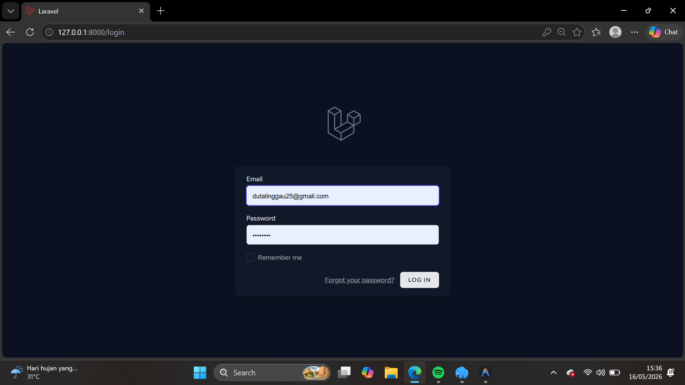
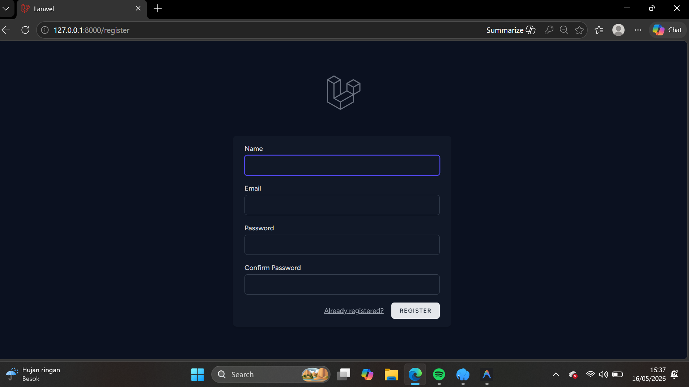
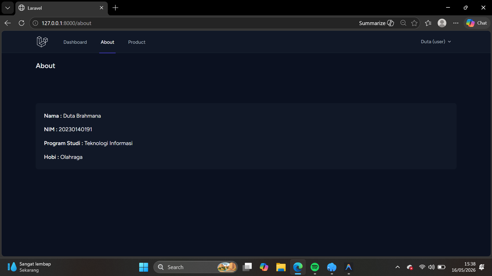

# 📑 Dokumentasi Tugas 2
## Praktikum Pengembangan Web Framework

Berikut adalah rincian tampilan antarmuka dari aplikasi yang telah dikembangkan:

| No | Nama Halaman | Keterangan | Screenshot |
| :--: | :--- | :--- | :--- |
| **1** | **Login** | Tampilan untuk halaman login. |  |
| **2** | **Register** | Tampilan untuk halaman register. |  |
| **3** | **About** | Tampilan untuk halaman about. |  |
